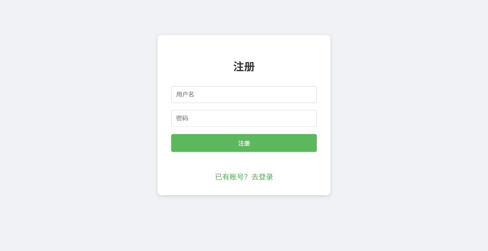
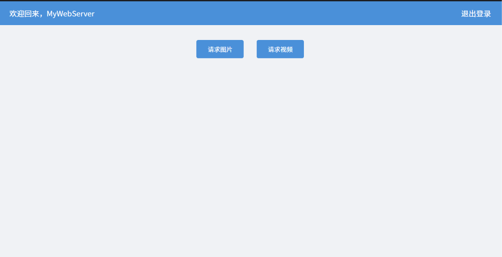
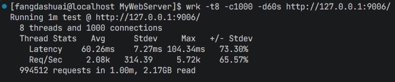
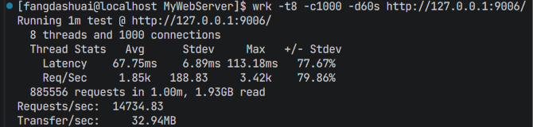
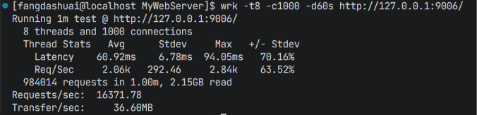
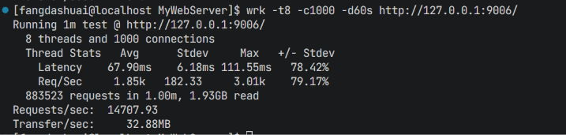
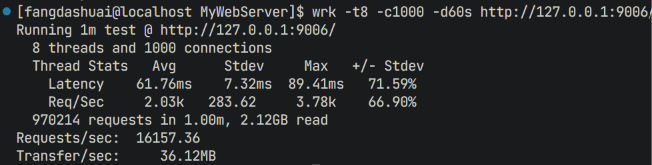
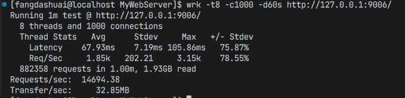
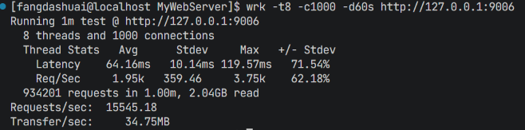
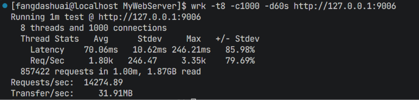

# MyWebServer

一个基于 Linux epoll 的高并发轻量级 HTTP 服务器（C++17），支持静态资源访问、用户注册/登录、keep-alive 长连接与多种触发/并发模式切换，代码结构清晰、模块化，适合学习与二次开发。

## 项目简介

- **事件驱动**：基于 `epoll` 多路复用，监听 fd 与连接 fd 均支持 **LT / ET** 触发模式组合（`-m 0~3`），事件循环以定时器最近到期时间作为 `epoll_wait` 超时，无阻塞轮询。
- **两种并发模型**：**半同步半异步模式**（主线程负责 I/O、线程池负责处理）与 **多线程 reactor 模式**（读、处理、写均在 worker 内完成），通过 `-a 0/1` 切换。
- **HTTP 协议**：主从状态机手工解析 HTTP/1.1 报文（请求行、请求头、请求体），支持 GET / POST，支持 keep-alive 长连接复用；静态文件通过 `mmap + writev` 分散写零拷贝发送。
- **业务功能**：注册 / 登录 CGI（基于 MySQL `user` 表校验），登录后跳转资源页浏览图片与视频。
- **模块化组件**：线程池（FIFO 队列 + 条件变量）、MySQL 连接池（RAII 自动获取归还）、定时器（`std::priority_queue` 小根堆 + 惰性删除 + fd 句柄映射）、同步/异步日志系统。
- **非活跃连接管理**：连接接入即注册定时器，有数据活动自动顺延，超时自动关闭，防止 fd 泄漏与误关复用连接。

## 功能特性

- 支持 `GET /index.html`、图片、视频等静态资源请求
- 支持 POST 注册（`/3`）、登录（`/2`）并跳转资源页
- 支持 keep-alive 长连接，空闲超时自动断开
- 支持 4 种触发组合模式 × 2 种并发模型自由切换

## 目录结构

```
MyWebServer/
├── src/         源文件（WebServer、HttpConn、ThreadPool、TimerManager、Log、Config、ConnectionPool）
├── include/     头文件
├── root/        静态资源（index.html 登录页、register.html 注册页、welcome.html 资源页、图片、视频）
├── docs/        文档（config.md、performance_analysis.md 等）
├── Makefile     构建脚本
└── wrk/         压测工具（可选）
```

## 环境依赖

- Linux 系统（使用 epoll，不支持 macOS/Windows）
- `g++` 支持 C++17、`make`
- 本地 MySQL 服务（端口 3306）

## 数据库初始化

服务器启动时连接本地 MySQL,需要准备数据库与用户表：

```sql
CREATE DATABASE IF NOT EXISTS mydb DEFAULT CHARSET utf8mb4;
USE mydb;
CREATE TABLE IF NOT EXISTS user (
    username VARCHAR(50) NOT NULL,
    passwd   VARCHAR(50) NOT NULL,
    PRIMARY KEY (username)
);
```

## 项目启动方式

### 1. 编译

```bash
make server        # 编译服务器
```

### 2. 启动服务器

```bash
./server                          # 使用全部默认参数（端口 9006）
./server -p 8080                  # 自定义端口
./server -p 8080 -m 3 -a 1 -t 16  # 全 ET + 多线程 reactor + 16 线程
```

### 3. 命令行参数

| 选项 | 参数 | 默认值 | 说明 |
|------|------|--------|------|
| `-p` | 整数 | 9006 | 监听端口号 |
| `-l` | 0/1 | 0 | 日志写入方式：0 同步，1 异步 |
| `-m` | 0-3 | 0 | 触发组合模式（见下表） |
| `-s` | 整数 | 8 | 数据库连接池数量 |
| `-t` | 整数 | 8 | 线程池线程数量 |
| `-c` | 0/1 | 0 | 是否关闭日志：0 否，1 是 |
| `-a` | 0/1 | 0 | 并发模型：0 半同步半异步，1 多线程 reactor |

### 4. 触发组合模式（-m）

| 值 | listenfd | connfd |
|----|----------|--------|
| 0 | LT 水平触发 | LT 水平触发 |
| 1 | LT 水平触发 | ET 边缘触发 |
| 2 | ET 边缘触发 | LT 水平触发 |
| 3 | ET 边缘触发 | ET 边缘触发 |

### 5. 访问

浏览器打开 `http://localhost:9006` 即可看到登录页，注册新账号后可登录进入资源页。

## 功能演示

### 注册演示



### 登录演示


### 请求资源演示



### 请求视频演示


## 八种组合模式压测

八种组合 = 触发组合（`-m 0~3`）× 并发模型（`-a 0/1`）。压测命令参考（项目自带 wrk）：

```bash
wrk -t8 -c1000 -d30s http://127.0.0.1:9006/index.html
```

| 触发组合 | 半同步半异步（`-a 0`） | 多线程 reactor（`-a 1`） |
|----------|------------------------|--------------------------|
| `-m 0` LT/LT |  |  |
| `-m 1` LT/ET |  |  |
| `-m 2` ET/LT |  |  |
| `-m 3` ET/ET |  |  |

<!-- 压测结果截图请按上述命名放入 docs/benchmark/ 目录（m<0-3>_a<0-1>.png） -->